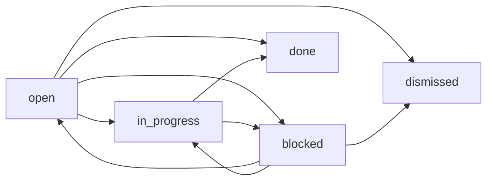
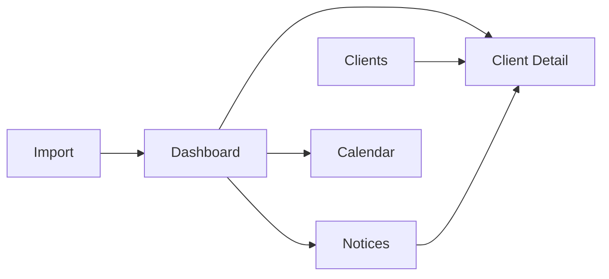

# DueDateHQ PRD

版本：v1.0  
日期：2026-04-22  
状态：Draft for execution

## 1. 文档目的

这是一份面向开发和产品对齐的正式 PRD。  
它替代之前的探索日志、设计草图和商业计划书摘要，回答 4 个问题：

- 我们到底要做什么
- 我们不做什么
- 用户如何完成核心工作流
- 每个页面和功能分别承担什么责任

本 PRD 主要服务于：

- 前端页面与交互设计
- 后端接口与状态模型设计
- Demo 范围控制
- 队友分工和开发优先级

## 2. 产品定义

### 2.1 一句话定义

DueDateHQ 是一个面向美国独立 CPA / 小型事务所的 `deadline intelligence + work orchestration` 产品，用来管理客户的税务截止日期、阻塞事项、官方政策变更与下一步动作。

### 2.2 不是做什么

DueDateHQ 不是：

- 报税软件
- 税额计算软件
- e-file 提交工具
- 完整 CRM / Billing / Engagement 系统
- 大而全的客户门户

### 2.3 做什么

DueDateHQ 负责：

- 接收或导入 CPA 已有客户档案
- 基于客户 filing profile 生成和维护 deadline
- 告诉 CPA 这周应该先做什么
- 跟踪哪些事项被卡住了
- 跟踪官方 notice / policy change 对哪些客户有影响
- 把 policy change 和风险转换成可执行工作项
- 提供轻量的状态流转、提醒和导出

## 3. 产品边界

### 3.1 在 DueDateHQ 中做的事

- 导入客户档案
- 管理客户稳定 profile
- 管理年度 tax profile
- 管理 jurisdictions / filing obligations / extensions
- 生成 deadline 和 weekly queue
- 管理 Track / Waiting on info / Notice / Watchlist
- 进行轻量操作：
  - Mark done
  - Remind later
  - Mark received
  - Create task
  - Adjust due date
  - Mark not needed
  - Dismiss notice
- 导出工作清单或 deadline 报告

### 3.2 不在 DueDateHQ 中做的事

- 填税表
- 报税计算
- 正式向 IRS / 州税局提交申报
- 完整客户签字授权流程
- 完整支付、开票、时间跟踪
- 深度财务明细处理

### 3.3 边界原则

判断一个功能是否应纳入产品时，统一使用这句话：

`这个动作是在管理税务工作，还是在真正完成税务专业操作？`

- 前者属于 DueDateHQ
- 后者不属于 DueDateHQ

### 3.4 核心对象定义

为了避免后续开发时概念混淆，以下对象必须严格区分：

#### Deadline

Deadline 是一个 `合规截止日期对象`。

它回答的是：

- 什么必须在什么时候之前完成
- 它属于哪个 client / jurisdiction / tax type
- 当前状态是什么

示例：

- `CA Franchise Tax return due on Apr 15`
- `NY estimated payment due on Jun 15`

Deadline 不是 task。  
Deadline 是客观存在的“必须面对的日期”。

#### Blocker

Blocker 是一个 `阻塞对象`。

它回答的是：

- 为什么当前某件事做不下去
- 卡在谁身上
- 下一步应该催谁或等什么

示例：

- `waiting on payroll report`
- `waiting on owner approval`
- `waiting on extension confirmation`

#### Notice

Notice 是一个 `外部变化对象`。

它回答的是：

- 官方来源发布了什么变化
- 它是否影响当前客户或 deadline
- 需要 CPA 做什么判断

示例：

- 某州灾难延期公告
- 某州税局 deadline policy change

#### Watch item

Watch item 是一个 `风险观察对象`。

它回答的是：

- 哪个客户或事项值得被盯着
- 虽然还不一定是立刻要做的 active work，但很可能很快变成 active work

示例：

- 某客户未来 10 天内可能因为资料不到位而变成 overdue
- 某客户因为多州 filing profile 复杂而需要被额外关注

#### Task

Task 是一个 `可执行工作项`。

它回答的是：

- CPA 或 staff 下一步具体要做什么管理动作
- 这件事现在是否已经进入 active execution queue

Task 不是报税执行本身，而是围绕 deadline 的工作协调动作。
Task 的存在前提是：`系统需要一个人参与进来。`

示例：

- `Review CA deadline impact for Harbor Studio`
- `Follow up with client for payroll report`
- `Confirm whether extension was filed`
- `Review notice impact and adjust due date`

#### 关键关系

- `Deadline` 是底层事实
- `Notice` 可能改变 `Deadline`
- `Blocker` 会阻止 `Deadline` 被推进
- `Watch item` 是潜在风险，不一定立刻需要执行
- `Task` 是系统要求人去做的具体下一步

一句话说：

`Deadline 是 what and when，Task 是 who should do what next。`

### 3.4.1 Task 的产品定义

Task 不是“凡是有事都建一个待办”。

Task 的正确定义是：

`Task 是系统认为现在需要 CPA 或 staff 去确认、推进、或完成的下一步动作。`

因此：

- 如果系统可以无歧义地自动完成，就不应该生成 task
- 如果需要人判断、确认、沟通、推进，就应该生成 task

### 3.4.2 Task 的三种类型

#### A. 纯人工 task

系统无法替代专业判断，只能提醒和组织。

示例：

- 判断某州 notice 是否真的适用于某客户
- 确认某客户今年是否真的需要某类 filing
- 确认 extension 是否已经 filed
- 决定是否要 override 某个 deadline

这类 task 的特点：

- 需要 CPA 的专业判断
- 系统不能自动拍板

#### B. 机器协助 + 人工确认 task

这是 DueDateHQ 最有价值的一类 task。

系统先完成 70% 到 90% 的整理或草拟，再让 CPA 做最后确认。

示例：

- 系统识别某条 notice 可能影响了 8 个客户，CPA 只需确认影响范围
- 系统已计算出新的 due date，CPA 只需 approve / adjust
- 系统已识别出缺失字段，CPA 只需决定 follow up 还是 ask later
- 系统草拟一条 follow-up message，CPA 决定发送或修改

这类 task 的特点：

- 系统先做大部分准备工作
- CPA 做最后确认或拒绝

#### C. 纯系统动作

这类不应该生成 task。

示例：

- reminder queue 重建
- 已确定规则下的 deadline 自动刷新
- 已确认 notice 的自动同步
- 审计日志写入

这类事情应该：

- 系统自动完成
- 只进入日志或历史
- 不打扰 CPA

### 3.4.3 Task 触发规则

以下情况应该生成 task：

- 需要人判断
- 需要人确认
- 需要人沟通或催办
- 需要人决定是否推进、调整、或忽略

以下情况不应该生成 task：

- 系统可以低风险自动完成
- 只是内部状态更新
- 不需要人参与就能闭环

一句话判断标准：

`会不会生成 task，只看这件事是否需要人参与。`

### 3.4.4 Task 与其他对象的关系

- `Deadline` 是底层事实
- `Notice` 可能触发 review task
- `Blocker` 可能触发 follow-up task
- `Watch item` 可能在升级后变成 task
- `Task` 最终进入 Track / Active work queue

也就是说：

- Notice 不是 task
- Watch item 不是 task
- Blocker 不是 task
- 这些对象都可能“生成 task”

### 3.4.5 谁来创建 task

Task 不应主要依赖 CPA 手动创建。

正确策略是：

- `系统自动创建为主`
- `CPA 手动创建为辅`

#### 系统自动创建

应作为主路径。

来源包括：

- deadline 临近，需要主动推进
- notice 需要 review
- blocker 需要 follow-up
- watch item 被升级为 active work

#### CPA 手动创建

只作为补充机制。

适用于：

- 特殊 follow-up
- 系统未覆盖到的内部协调动作
- 某个客户的个性化风险提醒

### 3.4.6 Task 的推荐分类

MVP 建议至少支持以下 task_type：

- `review`
  - 例如 review notice impact、confirm filing obligation
- `follow_up`
  - 例如 ask client for payroll report、check extension status
- `deadline_action`
  - 例如 confirm due date、adjust due date、mark filing not needed
- `manual`
  - 例如 CPA 自己补的一条内部工作项

### 3.4.7 Task 的推荐状态

MVP 建议至少支持以下 status：

- `open`
- `in_progress`
- `blocked`
- `done`
- `dismissed`

状态含义：

- `open`
  已生成，尚未开始处理
- `in_progress`
  已开始处理
- `blocked`
  因缺资料 / 缺确认暂时无法推进
- `done`
  已处理完成
- `dismissed`
  证明不需要继续处理

### 3.4.8 Task 数据模型建议

MVP 建议把 Task 作为独立一等对象建模，而不是挂在 deadline 或 notice 下面作为临时字段。

建议字段：

- `task_id`
- `tenant_id`
- `client_id`
- `title`
- `description`
- `task_type`
- `status`
- `priority`
- `source_type`
- `source_id`
- `owner_user_id`
- `due_at`
- `created_at`
- `updated_at`
- `completed_at`
- `dismissed_at`

字段说明：

- `title`
  给用户看的短标题，例如 `Review CA notice impact`
- `description`
  补充说明，解释为什么这条 task 存在
- `task_type`
  见上面的推荐分类
- `status`
  当前状态
- `priority`
  建议支持 `critical / high / normal / low`
- `source_type`
  说明 task 从哪里来的
- `source_id`
  指向具体来源对象
- `owner_user_id`
  这条 task 当前归谁
- `due_at`
  这条 task 本身的期望完成时间，不一定等于 deadline 的 due date

### 3.4.9 source_type 建议

MVP 建议至少支持：

- `deadline`
- `notice`
- `blocker`
- `watch_item`
- `manual`

设计意义：

- 前端可以解释这条 task 为什么出现
- 点击 task 后可以跳回原对象
- Notice、Watchlist、Waiting on info 才能和 Track 真正打通

### 3.4.10 Task 的状态流转

推荐状态流转如下：

解释：

- `open`
  系统已生成，等待有人接手
- `in_progress`
  已经开始处理
- `blocked`
  当前无法继续，通常因为缺资料或缺确认
- `done`
  已经处理完
- `dismissed`
  不需要继续处理，或证明不适用

### 3.4.11 Task 与 Dashboard 的对应关系

Dashboard 不应直接混合展示所有对象，而应按如下方式组织：

- `Track`
  展示 `status in (open, in_progress)` 的 active tasks
- `Waiting on info`
  展示 blocker，也可以展示 `status = blocked` 的 follow_up tasks
- `Notice`
  展示尚未转成 task 的 notice objects
- `Watchlist`
  展示尚未升级的风险观察对象

换句话说：

- Notice 进入 Track 的前提是 `Create task`
- Watchlist 进入 Track 的前提是 `Escalate to task`
- Waiting on info 本质上是 blocker 视图，不等于 task list

### 3.4.12 Task 的系统生成规则

建议 MVP 先做最小但最有用的自动生成规则。

#### Rule A：Notice review task

触发条件：

- 某条 notice 影响一个或多个 client
- 且系统不能无歧义自动完成全部更新

生成结果：

- 为受影响 client 生成 `review` task

#### Rule B：Missing info follow-up task

触发条件：

- client onboarding / import 过程中存在 deadline-driving missing field

生成结果：

- 生成 `follow_up` task

#### Rule C：Deadline action task

触发条件：

- 某 deadline 临近
- 且该事项需要 CPA 主动确认或推进

生成结果：

- 生成 `deadline_action` task

#### Rule D：Watchlist escalation task

触发条件：

- watch item 被 CPA 手动升级
- 或系统规则判断风险升高到 active work

生成结果：

- 生成 `review` 或 `deadline_action` task

### 3.4.13 MVP 不做的 task 能力

第一阶段先不要做：

- 复杂子任务树
- task comments / mentions / threaded discussion
- 多人协作看板
- SLA / automation rules engine
- 重型 project management 能力

Task 在 MVP 中应保持轻量：

- 够解释
- 够执行
- 够追踪

不要把它做成新的通用项目管理系统。

### 3.5 Dashboard 四个 lane 的真实含义

#### Track

Track 展示的是 `active tasks`，不是单纯展示所有 deadline。

只有当某个 deadline 已经需要人实际推进时，它才应该出现在 Track。

也就是说，Track 里每一行的正确理解是：

`现在这件事需要有人处理。`

#### Waiting on info

Waiting on info 展示的是 `blockers`。

这里不是 active execution，而是“现在做不下去，需要先补信息”。

#### Notice

Notice 展示的是 `外部变化对象`，不是 task。

只有当用户选择 `Create task` 之后，它才会进入 Track。

#### Watchlist

Watchlist 展示的是 `风险观察对象`，不是 active task。

只有当用户决定升级处理时，它才会进入 Track。

## 4. 目标用户

### 4.1 核心用户

美国独立 CPA / 1-3 人小型事务所

典型特征：

- 服务 30-150 个客户
- 客户跨多个州
- 当前大量依赖 Excel、Google Calendar、旧桌面工具
- 极度害怕漏报、忘报、错过 election / extension / multistate filing

### 4.2 次级用户

- 同一事务所内的 staff accountant / admin
- 负责资料催收或 deadline 跟进的人

### 4.3 非目标用户

- 个人报税终端用户
- 大型事务所复杂运营管理场景
- 只需要通用任务管理工具的用户

## 5. 用户问题

### 5.1 核心痛点

- 不知道自己是否漏了某个州的某个截止日
- 客户多、州多、税种多，靠手工维护认知负担太高
- 资料不全时不知道哪件事被卡住了
- notice 来了以后，不知道影响哪些客户
- 现有工具要么太旧、要么太贵、要么不聚焦 deadline

### 5.2 用户真正想买的结果

- 少漏事
- 少焦虑
- 更快知道本周优先级
- 少花时间手工维护 Excel 和日历

## 6. 产品目标与非目标

### 6.1 产品目标

MVP 目标：

- 让 CPA 能从已有客户数据开始
- 生成一个可信的 weekly triage dashboard
- 能对 deadline / blocker / notice 做轻量操作
- 能看清楚单个客户为什么有风险

### 6.2 非目标

MVP 不追求：

- 真实完成全 50 州法规自动理解
- 完整 portal
- 复杂 staff management
- 多租户完整 SaaS 商业化功能

## 7. 核心工作流

本产品围绕 4 条主工作流设计。

### 7.1 工作流 A：每周开工分诊

用户目标：5 分钟内知道这周先做什么

步骤：

1. 打开 Dashboard
2. 查看 Track
3. 查看 Waiting on info
4. 查看 Notice
5. 查看 Watchlist
6. 点进某个 client 或 notice
7. 做动作并返回 Dashboard

成功标准：

- 用户能快速判断本周优先级
- 页面不会让用户困惑“我该先看哪里”

### 7.2 工作流 B：从现有 Excel / 表格接入

用户目标：不要从空白表单开始

步骤：

1. 进入 Import
2. 上传或选择已有 spreadsheet
3. 系统进行字段 mapping
4. 用户确认 mapping
5. 用户补少量关键 missing fields
6. 用户点击 Generate dashboard
7. 系统进入 Dashboard

成功标准：

- 导入流程清楚、短、可完成
- 用户不需要重新录一遍全部资料

### 7.3 工作流 C：处理官方 Notice

用户目标：把政策变化变成可执行工作

步骤：

1. 进入 Notice 页面或从 Dashboard Notice lane 进入
2. 查看 source、summary、affected clients
3. 选择：
   - Mark read
   - Dismiss
   - Create task
4. 如有必要，进入某个 client detail 继续处理

成功标准：

- notice 不只是被看到，而是变成决策
- 用户知道哪些客户受影响

### 7.4 工作流 D：处理单个高风险客户

用户目标：从组合视角切到客户视角，再切回来

步骤：

1. 从 Dashboard / Clients 打开某个 client
2. 查看 client profile / deadlines / blockers / history
3. 选中一条 obligation
4. 做动作：
   - Mark done
   - Remind later
   - Adjust due date
   - Mark not needed
5. 返回 Dashboard

成功标准：

- 用户明白这个客户为什么出现在当前队列
- 能完成至少一个真实管理动作

## 8. 信息架构

主导航页面：

1. Dashboard
2. Clients
3. Import
4. Notices
5. Calendar
6. Rules

子页面：

- Client Detail

页面关系：

## 9. 页面 PRD

### 9.1 Dashboard

#### 目标

成为 CPA 每周工作的主入口。

#### 核心区块

- Track
- Waiting on info
- Notice
- Watchlist
- Decision Panel

#### 每个区块定义

- `Track`
  当前需要实际推进的 work queue
- `Waiting on info`
  由于缺资料 / 缺确认而无法推进的事项
- `Notice`
  官方更新、规则变更、延期公告
- `Watchlist`
  不是立刻到期，但值得盯着的高风险客户

#### 页面逻辑

- 用户一次只聚焦一个 lane
- 中间显示当前 lane 的 list
- 右侧显示当前选中项的 Decision Panel
- 用户动作后，list 和 decision panel 都即时更新

#### 支持操作

- Track:
  - Open client
  - Mark done
  - Remind later
- Waiting on info:
  - Draft outreach
  - Mark received
  - Open client
- Notice:
  - Mark read
  - Dismiss
  - Create task
  - Open notice
- Watchlist:
  - Create task
  - Remove
  - Open client

#### 页面状态

- default
- item selected
- empty lane
- action success

#### 原型说明

- 上部是页面标题和极轻量说明
- 主体是四个紧凑 lane tab
- 下部左侧是当前 lane list
- 下部右侧是 Decision Panel
- Help 通过小 icon 或菜单展开，不固定占位

### 9.2 Clients

#### 目标

提供整个 client portfolio 的概览与入口。

#### 核心区块

- client list
- search / filter
- risk tag
- intake status
- next deadline

#### 页面逻辑

- 用户浏览客户列表
- 点击后进入 Client Detail

#### 支持操作

- Open client
- Filter by risk / status / state

#### 页面状态

- default list
- filtered list
- empty search result

### 9.3 Client Detail

#### 目标

让用户理解单个客户的 filing context，并能执行一个具体动作。

#### 核心区块

- client summary
- annual filing profile
- jurisdictions
- open obligations
- blockers
- history / activity
- next action panel

#### 页面逻辑

- 用户先看 summary
- 再查看 open obligations
- 选中某条 obligation 后，右侧显示 next action

#### 支持操作

- Mark done
- Remind later
- Adjust due date
- Mark not needed
- Open related notice

#### 页面状态

- default
- obligation selected
- no open obligations

### 9.4 Import

#### 目标

让 CPA 能从现有数据开始，不从零录入。

#### 核心区块

- source preview
- detected mappings
- missing fields
- import readiness
- generate dashboard CTA

#### 页面逻辑

- 用户先看 source preview
- 再确认 mapping
- 再补关键缺失字段
- readiness 达到阈值后可生成 dashboard

#### 支持操作

- Confirm mapping
- Mark resolved
- Ask later
- Generate dashboard

#### 页面状态

- fresh upload
- mapping reviewed
- missing fields unresolved
- ready to generate
- generated

#### 原型说明

- 页面最重要的是“步骤感”
- 用户始终要知道自己在第几步
- 不展示过多不相关字段

### 9.5 Notices

#### 目标

把政策/官方变化转成可执行工作。

#### 核心区块

- notice queue
- selected notice summary
- source link
- affected clients
- handling mode
- action buttons

#### 页面逻辑

- 选中一条 notice
- 查看 summary + affected clients
- 决定是否标记为 read、dismiss 或 create task

#### 支持操作

- Mark read
- Dismiss
- Create task
- Open client

#### 页面状态

- unread
- read
- dismissed
- queue empty

### 9.6 Calendar

#### 目标

帮助用户用月视角查看 filing workload。

#### 核心区块

- month grid
- deadlines per day
- filters

#### 页面逻辑

- 默认看本月
- 可按 state / client / tax type filter

### 9.7 Rules

#### 目标

给内部团队或高级用户一个轻量规则与 review queue 入口。

#### 核心区块

- rule templates
- review queue
- reminder cadence summary

#### 备注

该页不是 MVP 主英雄页面，优先级低于 Dashboard / Import / Client / Notices。

## 10. 功能详单

### 10.1 P0 必做

- Dashboard 主工作台
- Clients 列表
- Client Detail
- Import -> Generate Dashboard 闭环
- Notices 处理流
- 基础 Calendar
- 轻量 help / guidance
- Deadline 状态动作

### 10.2 P1 应做

- 更完整的 filter / search
- 更好的 notice status 视图
- 导出 CSV
- 更清楚的 extension 展示
- state / tax type drilldown

### 10.3 P2 可延后

- PDF 导出
- 完整客户 portal
- 复杂 AI 自动跟进
- 实时 voice mode
- 更完整 rules admin

## 11. 数据与状态模型要求

前端必须围绕以下核心对象组织：

- Client
- ClientTaxProfile
- ClientJurisdiction
- ClientContact
- Deadline
- Reminder
- Notice
- ReviewQueueItem

前端页面不应直接暴露底层表结构，但其交互必须与这些实体一致。

## 12. 引导与帮助设计原则

### 12.1 原则

- 用户只需要 onboarding 一次，不应长期被大块引导内容占据页面
- 页面默认应简洁
- 引导应采用：
  - 小型 help icon
  - hover / click tooltip
  - contextual help menu

### 12.2 不推荐

- 固定占据页面空间的大块 workflow guide
- 对同一信息重复解释两次
- 为了教学牺牲工作台效率

## 13. 设计原则

- 工作流优先于装饰
- 一个页面只承载一个主要任务
- 每次交互后，页面应明确反馈“接下来做什么”
- 解释应按需出现，而不是默认全展开
- 产品语言应贴近 CPA 工作语境，不使用模糊 marketing 词

## 14. MVP 验收标准

如果以下条件都成立，则 MVP 可认为基本成立：

- 用户可以从 Import 开始，不从空白表单开始
- 用户可以生成一个 weekly dashboard
- Dashboard 上四个 lane 定义清楚且可操作
- 用户可以从 Dashboard 进入 Client Detail
- 用户可以从 Notice 创建 task
- 用户可以完成至少一条从 import 到 dashboard 到 client action 的完整旅程

## 15. 当前开发优先级

按顺序执行：

1. Dashboard 收敛成清晰主工作台
2. Import -> Generate Dashboard 真正闭环
3. Client Detail 的状态流转
4. Notice -> Create task -> 回到 Track
5. Calendar / Rules 收尾

## 16. 打开问题

以下问题留待后续版本决定：

- 50 州规则库做到什么深度才算“可上线”
- notice 到 task 的自动化程度是否需要更强 AI
- 客户 portal 是否作为独立二期
- extension 处理是否需要单独 workflow
- export 的最终格式是否以 CSV 优先还是 PDF 优先

## 17. 附录：与现有文档关系

本 PRD 建立在以下材料之上：

- 最初商业计划书与价值主张材料
- CPA 信息收集调研结论
- 当前仓库中的产品设计探索日志
- 当前交互层开发指导文档

但从今天开始，后续开发若出现冲突：

`以本 PRD 为准。`
